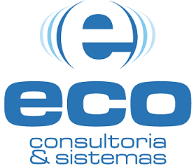

<center></center>

<br>

# Teste técnico da Eco Consultoria

## Projeto realizado para vaga de desenvolvedor PHP na empresa Eco Consultoria. O desafio era fazer um gerenciador de tarefas.

<br>


<br>

<h4 align="center"> 
	🚧   Em construção...  🚧
</h4>

### Features

-   [x] Cadastro de usuário
-   [x] Criar tarefa
-   [ ] Atualizar tarefa
-   [ ] Deletar tarefa

### Pré-requisitos

Antes de começar, você vai precisar ter instalado em sua máquina as seguintes ferramentas:
[Git](https://git-scm.com), [Laravel](https://laravel.com/docs/7.x/installation), [Apache](https://www.apachefriends.org/pt_br/index.html), [MySQL](https://www.apachefriends.org/pt_br/index.html).
Além disto é bom ter um editor para trabalhar com o código como [VSCode](https://code.visualstudio.com/)

### 🎲 Rodando

```bash
# Clone este repositório
$ git clone <https://github.com/Iago-pixel/eco-consultoria-teste.git>

# Acesse a pasta do projeto no terminal/cmd
$ cd eco-consultoria-teste

# Instale as dependências
$ composer install

# Execute as migrates
$ php artisan migrate

# O servidor inciará com
$ php artisan serve
```

---

 
 <br />
 <sub><b>Iago Vinícius</b></sub>

Feito com ❤️ por Iago Vinícius 👋🏽 Entre em contato!

[](https://www.linkedin.com/in/iago-vinicius-souza/)
